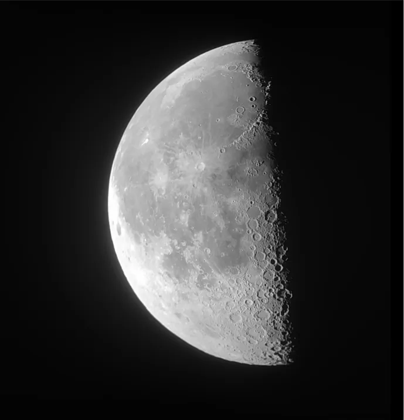

# The Moon

Gear:

- Bresser Messier 8” Dob f/6
- Generic Mobile Adapter
- GSO SuperView 30mm Wide FMC Eyepiece
- Redmi K20 Pro

Data acquisition:

- ~7.5 minutes untracked video @ 60fps

Processing:

- PIPP
- AutoStakkert! 3
- Siril for post-processing

Conditions:

- Bortle 3
- Good seeing