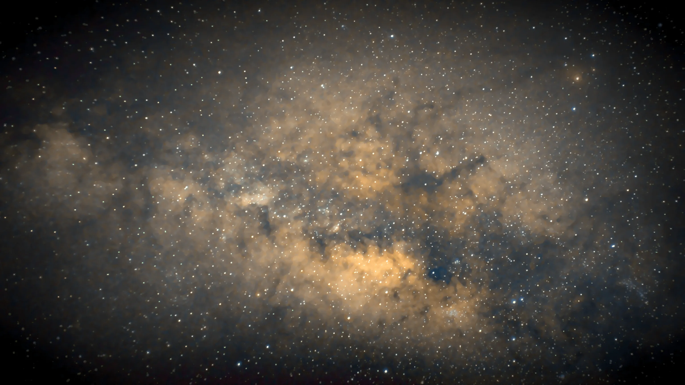

# The Milky Way
Gear:

- Raspberry Pi Camera Module V3
- Generic tripod

Data acquisition:

- 13 sec * 107 frames @ ISO 1600

Processing:

- Siril
- StarXTerminator (stars processed separately)

Conditions:

- Bortle 4
- Average seeing

This is one of my favourites. I just asked the raspberry pi to start shooting images when it’s powered on. I had no way of confirming if it was actually shooting, and I didn’t set up a status display because I was in a hurry to get to the site. For as long as I could, I was just pointing the “camera” towards the milky way, hoping that it was recording data.

I came back home and was elated to find out that the camera was indeed shooting, and I had captured a total of 107 frames. I processed them in Siril (stars processed separately), and this is how it turned out. Not too bad for a pi, if you ask me!
